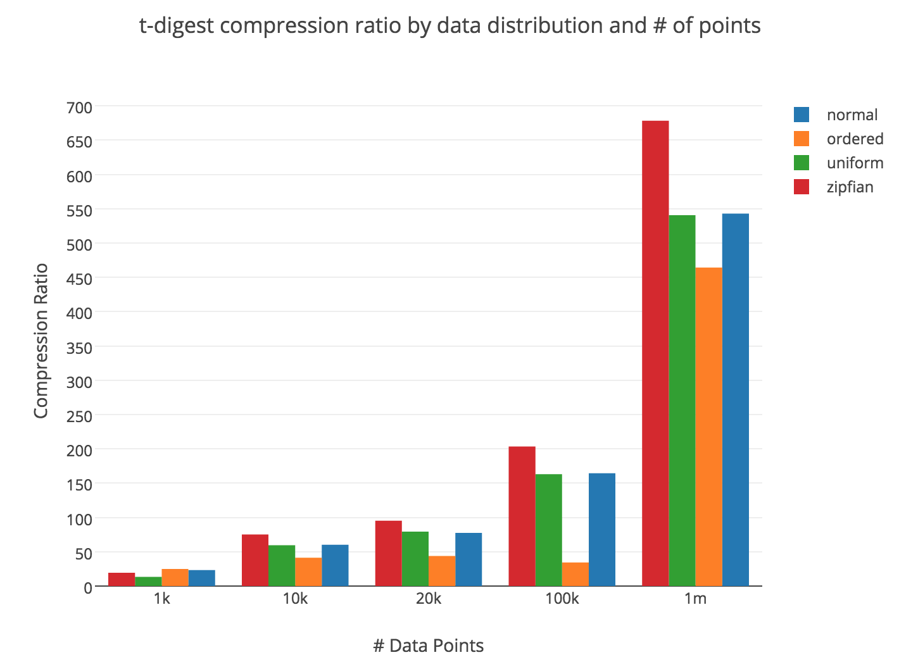

# tdigest #
 

This is a Go implementation of Ted Dunning's
[t-digest](https://github.com/tdunning/t-digest), which is a clever
data structure/algorithm for computing approximate quantiles of a
stream of data.

You should use this if you want to efficiently compute extreme rank
statistics of a large stream of data, like the 99.9th percentile.

## Algorithm ##

For example, in the Real World, the stream of data might be *service
timings*, measuring how long a server takes to respond to clients. You
can feed this stream of data through a t-digest and get out
approximations of any quantile you like: the 50th percentile or 95th
percentile or 99th or 99.99th or 28.31th are all computable.

Exact quantiles would require that you hold all the data in memory,
but the t-digest can hold a small fraction - often just a few
kilobytes to represent many millions of datapoints. Measurements of
the compression ratio show that compression improves super-linearly as
more datapoints are fed into the t-digest.

How good are the approximations? Well, it depends, but they tend to be
quite good, especially out towards extreme percentiles like the 99th
or 99.9th; Ted Dunning found errors of just a few parts per million at
the 99.9th and 0.1th percentiles.

Error will be largest in the middle - the median is the least accurate
point in the t-digest.

The actual precision can be controlled with the `compression`
parameter passed to the constructor function `New` in this
package. Lower `compression` parameters will result in poorer
compression, but will improve performance in estimating quantiles. If
you care deeply about tuning such things, experiment with the
compression ratio.

## Benchmarks ##

Data compresses well, with compression ratios of around 20 for small
datasets (1k datapoints) and 500 for largeish ones (1M
datapoints). The precise compression ratio depends a bit on your
data's distribution - exponential data does well, while ordered data
does poorly:

In general, adding a datapoint takes about 1 to 4 microseconds on my
2014 Macbook Pro. This is fast enough for many purposes, but if you
have any concern, you should just run the benchmarks on your targeted
syste. You can do that with `go test -bench . ./...`.

Quantiles are very, very quick to calculate, and typically take tens
of nanoseconds. They might take up to a few hundred nanoseconds for
large, poorly compressed (read: ordered) datasets, but in general, you
don't have to worry about the speed of calls to Quantile.

